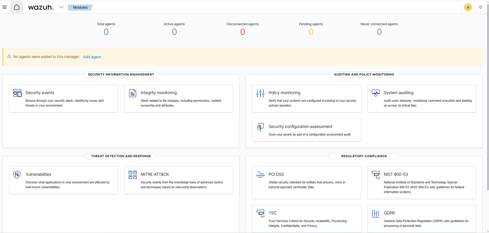
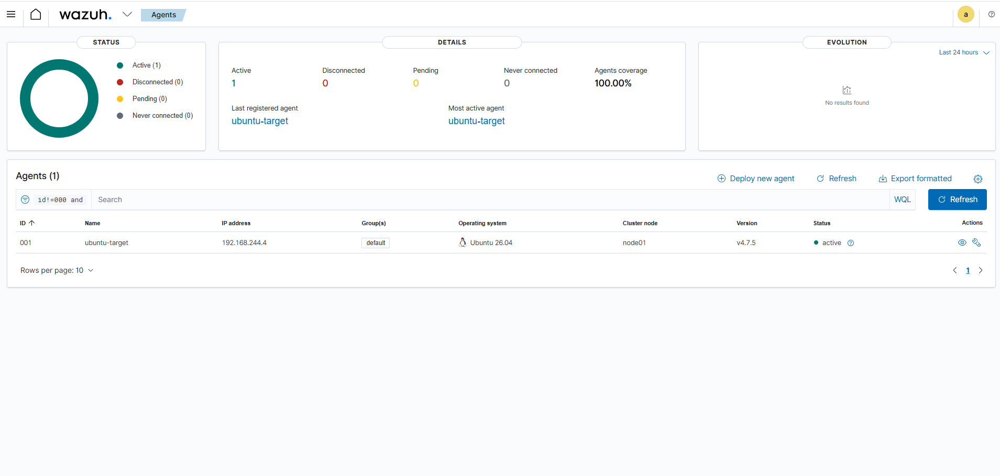
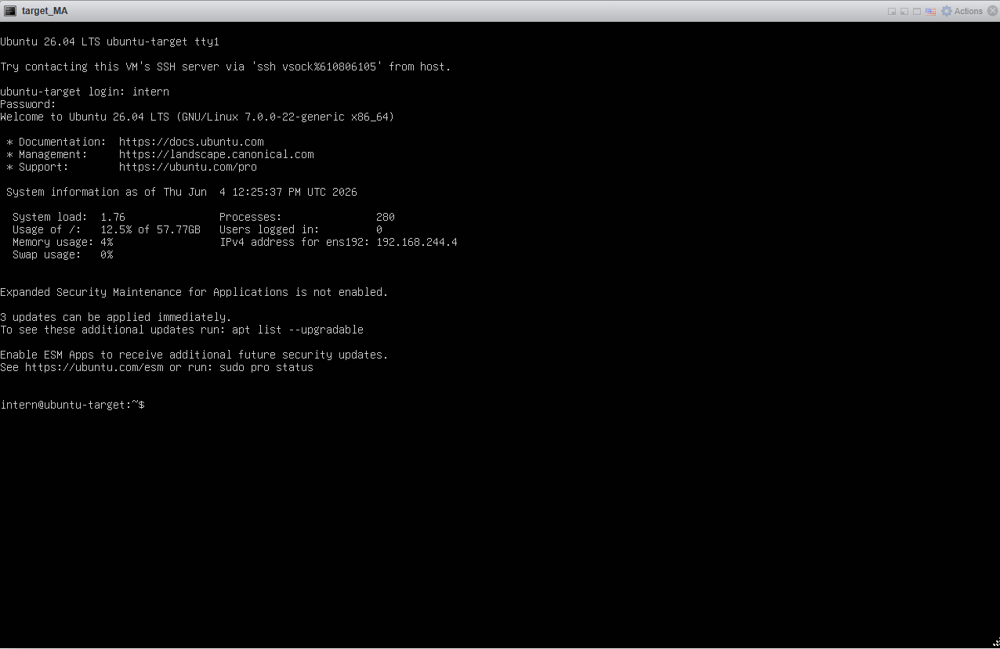
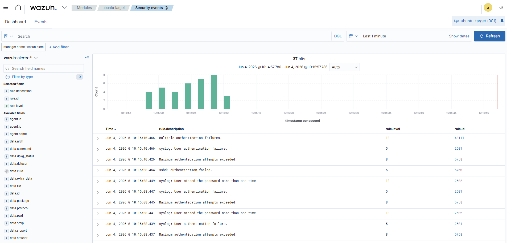

# Phase 1 — On-Premise Setup Guide

## Overview
This guide documents the setup of the on-premise environment for the Hybrid Security Operations Lab. The environment consists of three virtual machines running on a physical ESXi server, configured to simulate real-world attack and detection scenarios.

---

## Environment Summary

| VM | OS | IP | Role |
|---|---|---|---|
| Ubuntu-Target | Ubuntu 26.04 LTS | 192.168.244.4 | Attack target |
| Wazuh-SIEM | Ubuntu 26.04 LTS | 192.168.244.9 | SIEM / Detection |
| Kali-Attacker | Kali Linux 2026.1 | 192.168.244.11 | Attacker machine |

**ESXi Host:** 192.168.244.20
**Wazuh Dashboard:** https://192.168.244.9

---

## Step 1 — ESXi Setup

Physical server running VMware ESXi hypervisor. All VMs are on the 192.168.244.x subnet and can communicate with each other directly.

| VM | CPU | RAM | Disk |
|---|---|---|---|
| Ubuntu-Target | 2 vCPU | 2GB | 30GB |
| Wazuh-SIEM | 4 vCPU | 8GB | 100GB |
| Kali-Attacker | 2 vCPU | 4GB | 40GB |

---

## Step 2 — Wazuh SIEM Installation

Wazuh was installed on a fresh Ubuntu 26.04 LTS VM using the Wazuh all-in-one installer.

```bash
curl -sO https://packages.wazuh.com/4.7/wazuh-install.sh
sudo bash wazuh-install.sh -a
```

Verify all three services are running:

```bash
sudo systemctl status wazuh-manager
sudo systemctl status wazuh-indexer
sudo systemctl status wazuh-dashboard
```

Dashboard access:
- URL: https://192.168.244.9
- Username: admin
- Password: stored securely, not committed to repo

---

## Step 3 — Ubuntu Target Setup

Fresh Ubuntu 26.04 LTS VM configured as the attack target with SSH and Apache running as attack surfaces.

Install Apache:

```bash
sudo apt install apache2 -y
sudo systemctl enable apache2
sudo systemctl start apache2
```

Verify SSH is running:

```bash
sudo systemctl status ssh
```

Create test user for brute force scenario:

```bash
sudo useradd -m testuser
echo "testuser:password123" | sudo chpasswd
```

---

## Step 4 — Wazuh Agent Installation on Ubuntu Target

The Wazuh agent was deployed from the Wazuh dashboard under Agents > Deploy new agent.

Settings used:
- Package: DEB amd64
- Server address: 192.168.244.9
- Agent name: ubuntu-target
- Group: default

Install command:

```bash
wget https://packages.wazuh.com/4.x/apt/pool/main/w/wazuh-agent/wazuh-agent_4.7.5-1_amd64.deb && sudo WAZUH_MANAGER='192.168.244.9' WAZUH_AGENT_NAME='ubuntu-target' dpkg -i ./wazuh-agent_4.7.5-1_amd64.deb
```

Start the agent:

```bash
sudo systemctl daemon-reload
sudo systemctl enable wazuh-agent
sudo systemctl start wazuh-agent
```

The ubuntu-target agent appeared as Active in the Wazuh dashboard within 60 seconds.

---

## Step 5 — Kali Linux Setup

Kali Linux 2026.1 installed as a fresh VM on ESXi.

- Hostname: kali-attacker-ma
- Desktop environment: Xfce
- Tools: top10 + default

Verify network connectivity:

```bash
ip a
ping 192.168.244.4
ping 192.168.244.9
```

Unzip rockyou wordlist:

```bash
sudo gunzip /usr/share/wordlists/rockyou.txt.gz
```

---

## Step 6 — Verify Full Connectivity

```bash
ping 192.168.244.4
ping 192.168.244.9
ping 192.168.244.11
```

---

## Startup Order

1. Wazuh SIEM — wait 2-3 minutes
2. Ubuntu Target
3. Kali

Shutdown order (reverse):

```bash
sudo shutdown -h now
```

1. Kali first
2. Ubuntu Target second
3. Wazuh SIEM last

---

## Network Notes

- All VMs on 192.168.244.x subnet
- Work computer on 192.168.240.x — cannot reach VMs directly
- Wazuh dashboard accessed via https://192.168.244.9
- Kali can reach all VMs directly on the same subnet

---

## Screenshots

### Wazuh Dashboard

*Wazuh SIEM dashboard showing all modules including Security Events, MITRE ATT&CK, and Vulnerability detection*

### Ubuntu Target Agent Active

*ubuntu-target registered as agent 001, status Active, IP 192.168.244.4, Ubuntu 26.04, Wazuh v4.7.5*

### Kali Linux Attacker Machine

*Kali Linux 2026.1 running on ESXi, used as the attacker machine for all attack scenarios*

### Ubuntu Target Running

*Ubuntu 26.04 LTS target VM running at 192.168.244.4, logged in as intern user*

### SSH Brute Force Detected

*Wazuh detecting SSH brute force attack from Kali (192.168.244.11) — 253 hits including Multiple authentication failures at level 10, mapped to MITRE T1110.001*
---

## Status

- [x] All three VMs installed and running
- [x] Wazuh SIEM dashboard accessible
- [x] Ubuntu target agent active and reporting
- [x] First attacks executed and detected
- [x] Screenshots committed to repo
