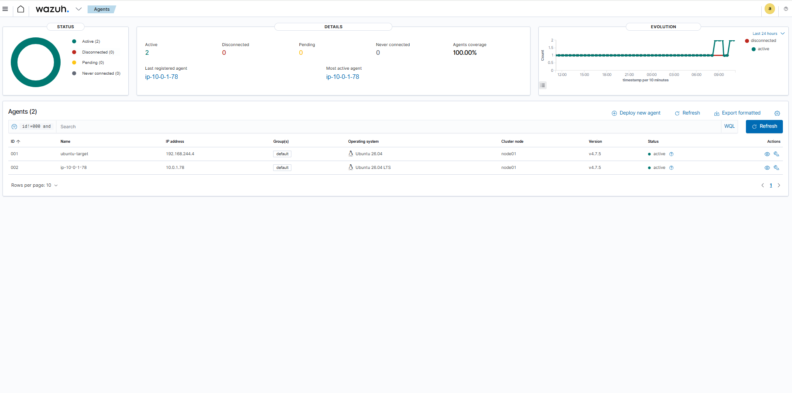
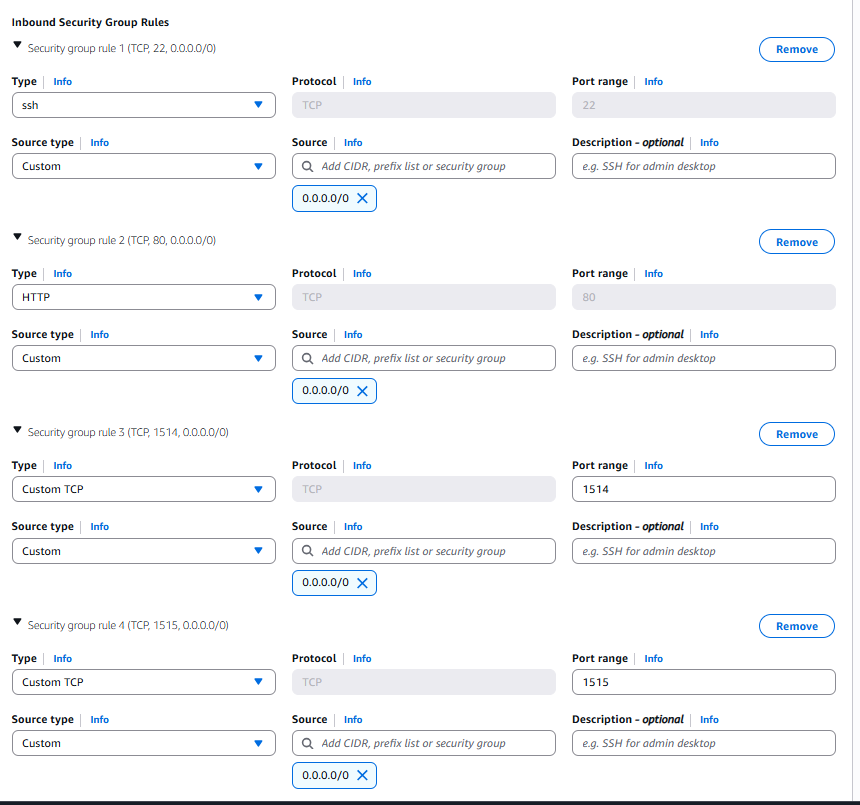
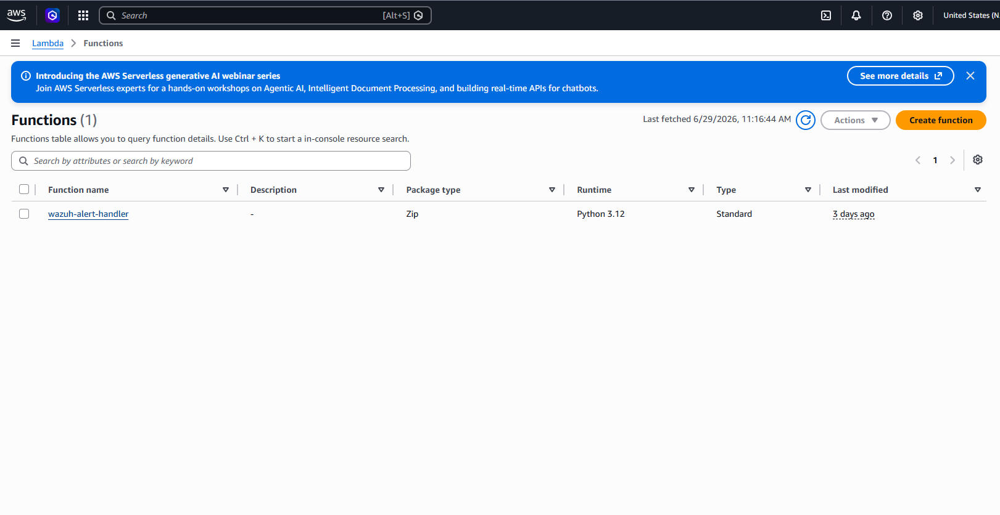
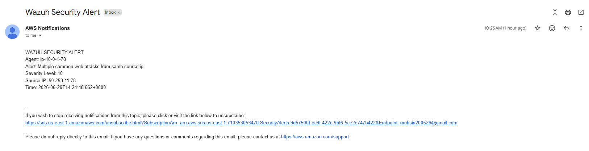

# Phase 2 — AWS Cloud Environment Setup

## Overview
Phase 2 extends the hybrid security lab into AWS by deploying an Ubuntu EC2 instance as a cloud attack target. A Wazuh agent on EC2 reports back to the on-premise Wazuh manager, creating a single dashboard showing security events from both environments simultaneously. AWS Lambda and SNS provide automated alerting when attacks are detected.

---

## Architecture

| Component | Details |
|---|---|
| VPC | 10.0.0.0/16 — us-east-1 |
| Public Subnet | 10.0.1.0/24 — us-east-1a |
| EC2 Instance | Ubuntu 26.04 LTS — t2.micro — 10.0.1.78 |
| EC2 Public IP | 98.84.50.190 |
| Wazuh Agent | v4.7.5 — reports to on-prem Wazuh via ngrok |
| Apache | Port 80 — web attack surface |
| Lambda | wazuh-alert-handler — receives Wazuh webhooks |
| SNS | SecurityAlerts topic — email notifications |
| Ngrok | Tunnel from public internet to private Wazuh manager |
| Connection Method | Ngrok TCP tunnel (Phase 2a) — Site-to-site VPN planned (Phase 2b) |

---

## Prerequisites
- Phase 1 on-premise environment running
- AWS account with EC2 and Lambda access
- Kali Linux VM with SSH key for EC2 access

---

## Step 1 — VPC Setup

1. Go to AWS Console → VPC → Create VPC
   - Name: hybrid-lab-vpc
   - IPv4 CIDR: 10.0.0.0/16

2. Create subnet
   - Name: hybrid-lab-public-subnet
   - Availability zone: us-east-1a
   - IPv4 CIDR: 10.0.1.0/24

3. Create internet gateway
   - Name: hybrid-lab-igw
   - Attach to hybrid-lab-vpc

4. Update route table
   - Add route: 0.0.0.0/0 → hybrid-lab-igw
   - Associate hybrid-lab-public-subnet

---

## Step 2 — EC2 Instance

**Launch settings:**
- AMI: Ubuntu 26.04 LTS
- Instance type: t2.micro (free tier)
- VPC: hybrid-lab-vpc
- Subnet: hybrid-lab-public-subnet
- Auto-assign public IP: Enable
- Key pair: hybrid-lab-key

**Security group — hybrid-lab-sg inbound rules:**
| Port | Protocol | Source | Purpose |
|---|---|---|---|
| 22 | TCP | 0.0.0.0/0 | SSH access |
| 80 | TCP | 0.0.0.0/0 | Apache web server |
| 1514 | TCP | 0.0.0.0/0 | Wazuh agent communication |
| 1515 | TCP | 0.0.0.0/0 | Wazuh agent enrollment |
| 4444 | TCP | 0.0.0.0/0 | Metasploit handler |

**EC2 Public IP:** 98.84.50.190
**EC2 Private IP:** 10.0.1.78

---

## Step 3 — Apache Installation

SSH into EC2 from Kali:
ssh -i /home/intern/.ssh/hybrid-lab-key-new ubuntu@98.84.50.190

Install Apache:
sudo apt update
sudo apt install apache2 -y
sudo systemctl enable apache2
sudo systemctl start apache2

---

## Step 4 — Wazuh Agent Installation

Install agent on EC2:
wget https://packages.wazuh.com/4.x/apt/pool/main/w/wazuh-agent/wazuh-agent_4.7.5-1_amd64.deb
sudo WAZUH_MANAGER='192.168.244.9' WAZUH_AGENT_NAME='ec2-target' dpkg -i wazuh-agent_4.7.5-1_amd64.deb

Start agent:
sudo systemctl daemon-reload
sudo systemctl enable wazuh-agent
sudo systemctl start wazuh-agent

Configure Apache log monitoring — add to /var/ossec/etc/ossec.conf:
<localfile>
  <log_format>apache</log_format>
  <location>/var/log/apache2/access.log</location>
</localfile>
<localfile>
  <log_format>apache</log_format>
  <location>/var/log/apache2/error.log</location>
</localfile>

---

## Step 5 — Connecting EC2 to On-Premise Wazuh via Ngrok

Since the on-premise Wazuh manager is on a private network (192.168.244.9) with no public IP, ngrok is used to create a public tunnel.

**On Wazuh SIEM VM:**
ngrok tcp 1514

Note the forwarding address (e.g. 4.tcp.ngrok.io:23994)

**Enroll agent (run once):**
On Wazuh SIEM VM run ngrok on port 1515:
ngrok tcp 1515

On EC2:
sudo /var/ossec/bin/agent-auth -m X.tcp.ngrok.io -p XXXXX

**Update agent config on EC2:**
sudo nano /var/ossec/etc/ossec.conf

Set:
<address>X.tcp.ngrok.io</address>
<port>XXXXX</port>

Restart agent:
sudo systemctl restart wazuh-agent

**Known limitation:** Ngrok free tier generates a new address every session. The ossec.conf on EC2 must be updated with the new address each time ngrok restarts. Production solution would be a site-to-site VPN between the ESXi network and the AWS VPC.

---

## Step 6 — Ngrok Reconnection SOP

Run every session if EC2 agent shows disconnected:

1. On Wazuh SIEM VM: ngrok tcp 1514
2. Note new address and port
3. On EC2 Instance Connect: sudo nano /var/ossec/etc/ossec.conf
4. Update address and port
5. sudo systemctl restart wazuh-agent
6. Verify EC2 agent shows Active in Wazuh dashboard

---

## Step 7 — Lambda and SNS Setup

**Create SNS topic:**
1. AWS Console → SNS → Create topic
2. Name: SecurityAlerts
3. Type: Standard
4. Create subscription → Email → your email address
5. Confirm subscription via email

**Create Lambda function:**
1. AWS Console → Lambda → Create function
2. Name: wazuh-alert-handler
3. Runtime: Python 3.12
4. Paste code from lambda/security_response.py
5. Deploy
6. Configuration → Permissions → attach AmazonSNSFullAccess to execution role
7. Configuration → Function URL → Create → Auth type: NONE
8. Note the function URL

**Configure Wazuh webhook:**
Add to /var/ossec/etc/ossec.conf on Wazuh SIEM VM:
<integration>
  <name>custom-webhook.py</name>
  <hook_url>YOUR_LAMBDA_FUNCTION_URL</hook_url>
  <level>10</level>
  <alert_format>json</alert_format>
</integration>

Restart Wazuh manager:
sudo systemctl restart wazuh-manager

**Result:** Any Wazuh alert at level 10 or above triggers Lambda which sends an email alert via SNS.

---

## Verification

Both agents active in Wazuh dashboard simultaneously:
- ubuntu-target (001) — 192.168.244.4 — Active
- ip-10-0-1-78 (002) — 10.0.1.78 — Active

Attack from Kali → EC2 receives it → Wazuh agent detects it → alert appears in dashboard → Lambda fires → email received.

---

## Screenshots

### Both Agents Active Simultaneously

*Wazuh dashboard showing both ubuntu-target (on-prem) and ip-10-0-1-78 (AWS EC2) active simultaneously — single pane of glass across hybrid environment*

### EC2 Security Groups

*AWS security group hybrid-lab-sg configured with inbound rules for SSH, HTTP, and Wazuh agent ports 1514 and 1515*

### Lambda Function

*AWS Lambda function wazuh-alert-handler configured to receive Wazuh webhooks and publish alerts to SNS*

### Automated Email Alert

*Automated email alert received via AWS SNS when Wazuh detected a high severity attack — triggered by Lambda webhook integration*
